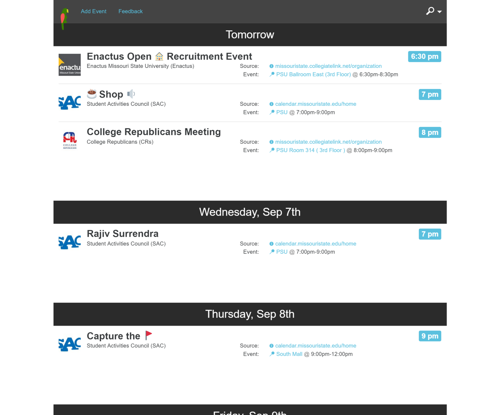

# Mostate Social

You are brand new to campus, its the beginning of the Fall semester, you have just moved to
Springfield to start your education. There are events going on everywhere around you,
clubs are recruiting, greek life is rushing, but where is it all?

If you were like me, you might have sat in the front of large bulletine boards of event flyers
taking notes on every event you could and sticking them in your phone to be reminded to attend.

This is what prompted the development of Mostate Social. My friend, Luke Baker, and I wanted to bring a
better experience to students trying to find campus events.

If you want to add your event, simply submit a Google form, and we'll add it to the site.

## Design

The design is impulsive, you can only see the upcoming events on the single page we provide.

> Are you free? Check what is happening, right now!

In this project we leveraged FullStory analytics technology to watch how people behaved on the site.

The information from FullStory's playback drove redesigns for search and filtering.

## Set up

Have NodeJS installed, we have different versions from 5.9 and up, it should n't be too important which version you use, but at the time of writing this, we are compiling everything on Node v5.9.1 and installing npm with NPM v3.7.3

Clone this repository, and from the folder of this repo, run `npm install`.

## Building data.

In order to precompile our Tab separated value sheets of data we get from Google Forms, we need to download those sheets into data/sheets folder. Then we also use a script to crawl over campus link to take all the names and uploaded icons from the organizations to create the data/sponsors-info.json file.

First, you may need to install typings by installing the typings utility by using `npm i -g typings` and then using `typings i` from the repo root.

Build the data/dist/events.json file by running `npm run build:data`.

## Debugging the website

Use `npm start` to use webpack-dev-server to serve the website's compiled files.

## Building docs

Use `npm run build:prod` to create the files in the ./docs folder to be hosted via gh-pages.

## Future

In the future we hope to use Elm in combination with a Golang, Elixir, or TypeScript backend. We have a few smaller projects in progress where we are playing with these languages individually before we make our final decision.
